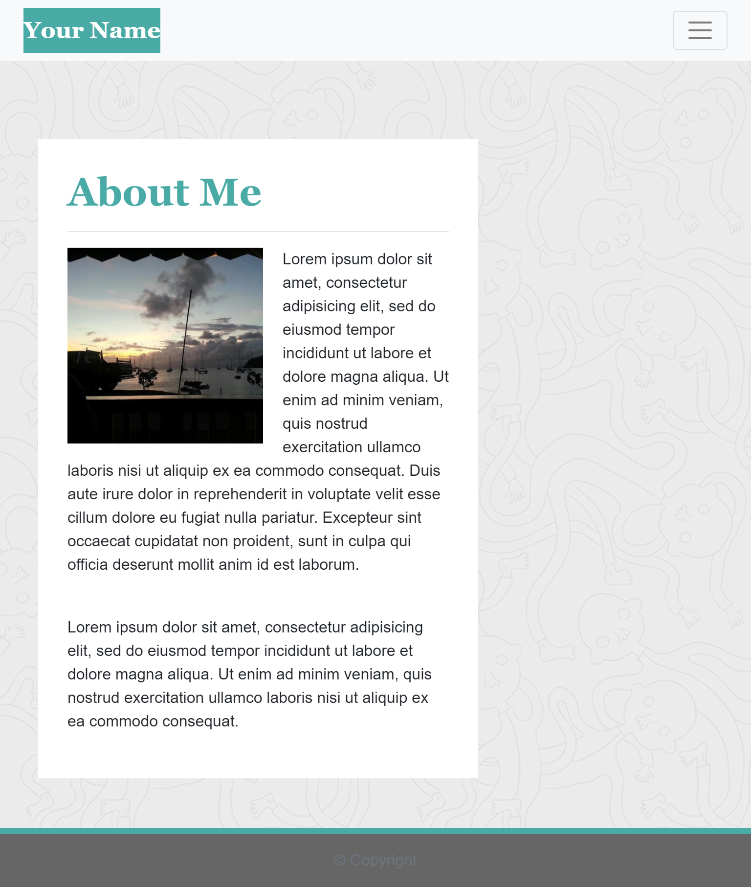
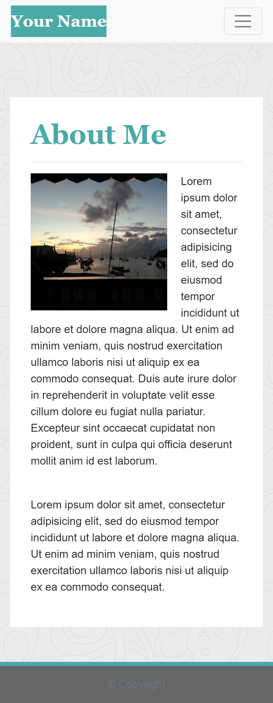
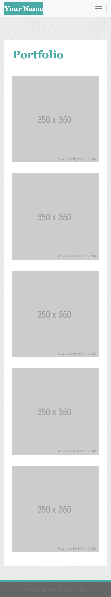
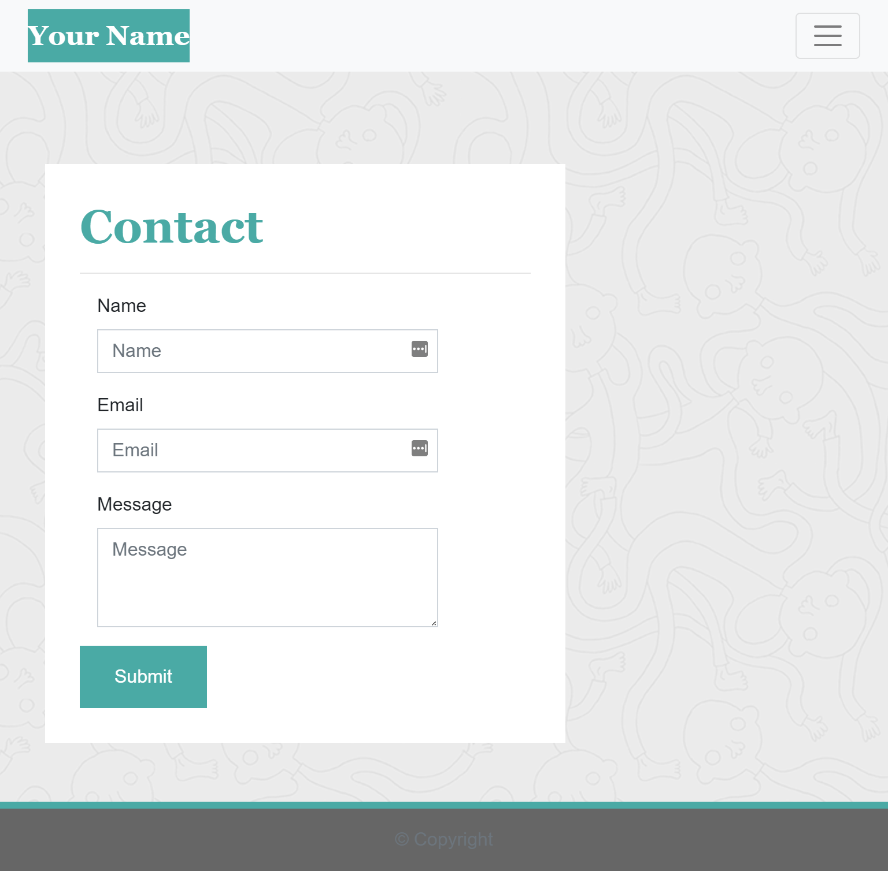

# Responsive Portfolio

In this homework project, I was tasked with using responsive design to ensure that web applications render well on a variety of devices and window or screen sizes to simulate my role as a developer to create a mobile-first application or add responsive design to an existing application. 

## Tasks

First, I was asked to use the Bootstrap CSS Framework to create a mobile responsive portfolio using the following guidelines:

* Create the following files files: `index.html`, `portfolio.html` and `contact.html`.

* Using Bootstrap, develop your portfolio site with the following items:

   * A navbar

   * A responsive layout

   * Responsive images

* The Bootstrap portfolio should minimize the use of media queries.

### Minimum Requirements

I was asked to meet the following minimum requirements:

* Functional, deployed application

* GitHub repository with README describing the project

* Navbar must be consistent on each page.

* Navbar on each page must contain links to Home/About, Contact, and Portfolio pages.

* All links must work.

* Must use semantic html.

* Each page must have valid and correct HTML. (use a validation service)

* Must contain your personalized information. (bio, name, images, links to social media, etc.)

* Must properly utilize Bootstrap components and grid system.

### Screenshots

Here are some screenshots of pages I was asked to use as models.

